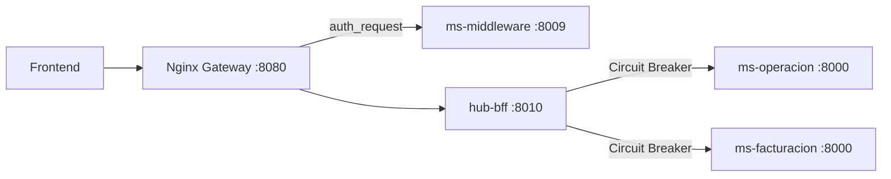

# hub-bff

Backend for Frontend (NestJS) del Hub Empresarial. Agrega en un solo payload los datos de **dos microservicios** (`ms-operacion` y `ms-facturacion`) y protege cada llamada downstream con el patrón **Circuit Breaker**.

## ¿Por qué un BFF?

Sin esta pieza, una pantalla de dashboard que necesita viajes (Operación) y facturas (Facturación) obliga al frontend a:
- hacer 2 llamadas HTTP a 2 dominios distintos del gateway,
- manejar 2 estados de carga/error independientes,
- y resolver él mismo qué hacer si una de las dos falla.

El BFF agrega ambas fuentes en una sola llamada (`GET /api/v1/bff/dashboard`), reduce el over-fetching/round-trips desde el cliente, y centraliza la resiliencia (Circuit Breaker) en un solo lugar en vez de duplicarla en cada frontend.



## Endpoints

| Ruta | Método | Auth | Descripción |
|---|---|---|---|
| `/api/v1/bff/health` | GET | público | Health check del BFF |
| `/api/v1/bff/dashboard` | GET | JWT (`Authorization: Bearer`) | Agrega `viajes` (Operación) + `facturacion` (Facturación) |
| `/bff/docs` | GET | público | Swagger UI |

Respuesta de `/api/v1/bff/dashboard`:
```json
{
  "viajes": [ /* array de viajes, ver hub-ms-operacion */ ],
  "facturacion": [ /* array de facturas, ver hub-ms-facturacion */ ],
  "meta": {
    "viajes_status": "ok",
    "facturacion_status": "ok"
  }
}
```

`meta.<servicio>_status` vale `"degraded"` cuando ese microservicio falló o el circuito está abierto — en ese caso la sección correspondiente llega como `[]`, pero el endpoint **siempre responde HTTP 200**: el frontend decide cómo mostrar el aviso de datos parciales sin tener que manejar un error duro.

## Patrón Circuit Breaker

`src/common/circuit-breaker/circuit-breaker.service.ts` envuelve cada llamada downstream (`opossum`). Un breaker independiente por microservicio (`'operacion'`, `'facturacion'`): si uno falla por sobre el umbral, el otro sigue funcionando con normalidad.

**Cómo demostrarlo en vivo** (con el stack levantado vía `docker-compose up` desde `hub-infra`):
```bash
# 1. Llamada normal
curl -H "Authorization: Bearer <token>" http://localhost:8080/api/v1/bff/dashboard
# meta.facturacion_status: "ok"

# 2. Apagar el microservicio de facturación
docker-compose stop ms-facturacion

# 3. Repetir la llamada un par de veces
curl -H "Authorization: Bearer <token>" http://localhost:8080/api/v1/bff/dashboard
# meta.facturacion_status: "degraded", facturacion: [], viajes intacto, siempre HTTP 200

# 4. Ver la evidencia del patrón actuando en los logs
docker-compose logs bff
# [CircuitBreakerService] Circuit OPEN: facturacion

# 5. Levantar el servicio de nuevo
docker-compose start ms-facturacion
# tras ~10s (resetTimeout) el circuito pasa a HALF_OPEN y luego CLOSED -> "ok"
```

## Variables de entorno

| Variable | Valor en dev |
|---|---|
| `PORT` | `8010` |
| `OPERACION_BASE_URL` | `http://ms-operacion:8000` |
| `FACTURACION_BASE_URL` | `http://ms-facturacion:8000` |
| `HTTP_TIMEOUT_MS` | `5000` |
| `CB_ERROR_THRESHOLD_PERCENTAGE` | `50` |
| `CB_TIMEOUT_MS` | `3000` |
| `CB_RESET_TIMEOUT_MS` | `10000` |

Ver `.env.example`.

## Instalar / ejecutar / probar

```bash
npm install
npm run start:dev          # standalone, sin Docker (requiere los microservicios accesibles)
npm run build && npm start # producción

npm run test               # tests unitarios
npm run test:cov           # tests + reporte de cobertura (umbral 60%)
```

Como parte del stack completo:
```bash
cd ../hub-infra
docker-compose up --build
curl http://localhost:8080/api/v1/bff/health
```

Ver `GUIA_PRUEBAS.md` para más detalle de testing y cobertura.

## Estructura del código

```
src/
  common/circuit-breaker/   # patrón Circuit Breaker, reutilizable por key
  operacion/                # adaptador HTTP hacia ms-operacion (equivalente a un Repository remoto)
  facturacion/              # adaptador HTTP hacia ms-facturacion
  dashboard/                # agregador BFF: combina operacion + facturacion en un solo payload
```

El BFF **no decodifica el JWT**: solo reenvía el header `Authorization` recibido del cliente hacia cada microservicio. La validación ya ocurre en nginx (`auth_request`) y de nuevo en cada microservicio downstream (`@login_required`).
